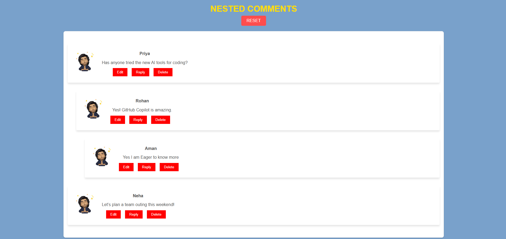

# Nested Comments JavaScript Project

This project implements a **Nested Comments** system where users can:
- Add, edit, and delete comments
- Reply to existing comments
- Edit and save comment text with a user-friendly interface
- Track character limits on replies

## Hosted Link
You can view the project live here [Nested Comments](https://nested-comments-flame.vercel.app/).

## Screenshot


## Features
- **Edit Comment**: Users can edit a comment's text.
- **Reply to Comment**: Users can reply to comments, with a 50-character limit for replies.
- **Delete Comment**: Users can delete comments.
- **Character Counter**: A real-time character counter for replies that warns when the character limit is exceeded.
- **Cancel Actions**: Users can cancel both edit and reply actions.
- **Reset Button**: To Refresh Page.

## Getting Started

To run this project locally, follow the steps below:

### Prerequisites
- Ensure you have a modern browser (Chrome, Firefox, Safari, etc.) to run the project.
- No server setup is required as this is a client-side JavaScript project.

### Installing

1. Clone the repository to your local machine:
    ```bash
    git clone https://github.com/MaverickCod/Nested-Comments/
    ```
2. Open the `index.html` file in a browser to view the project.

### File Structure

```
nested-comments-js/
│
├── index.html          # The main HTML file for the app
├── style.css           # CSS file for styling the comments UI
├── script.js           # JavaScript file with the logic for comments, editing, and replying
└── README.md           # Project documentation
```

### Usage

1. **Adding Comments**: You can add new comments by typing in the comment input box and clicking the "Add" button.
2. **Editing Comments**: Click the "Edit" button next to any comment. The text field will transform into an input box with the option to "Save" or "Cancel" the edit.
3. **Replying to Comments**: To reply to a comment, click the "Reply" button. A text area will appear to enter the reply with a live character counter showing the remaining characters.
4. **Deleting Comments**: Click the "Delete" button to remove the comment from the list.


### Code Explanation

- **`script.js`**:
  - Handles the core functionality such as adding, editing, deleting, and replying to comments.
  - The logic prevents multiple "Edit" or "Reply" buttons from being active simultaneously.
  - The character counter for replies ensures that users stay within the 50-character limit.

- **`style.css`**:
  - Styles the comments section, ensuring a clean and user-friendly UI.
  - Includes hover effects on buttons and visual feedback for character limits.

### Contributions

If you'd like to contribute to this project, feel free to submit a pull request! Make sure to update the documentation if you make any significant changes.

### License

This project is open-source and available under the [MIT License](LICENSE).
